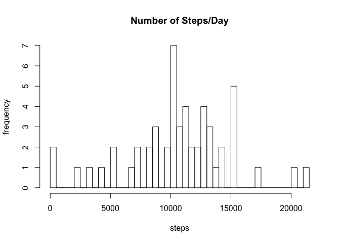
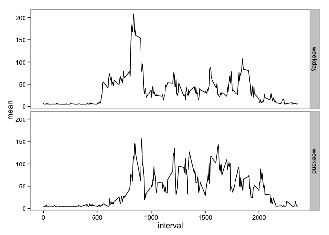

# Reproducible Research Homework Assignment 1
Monobot  
September 17, 2015  

please note: a majority of the notes describing each section is either summarized, or copied verbatum from the coursera reproducible research homework assignment. 

###Load and preprocess data


```r
#import libraries
library(plyr)
library(dplyr)
```

```
## Warning: package 'dplyr' was built under R version 3.1.2
```

```
## 
## Attaching package: 'dplyr'
## 
## The following objects are masked from 'package:plyr':
## 
##     arrange, count, desc, failwith, id, mutate, rename, summarise,
##     summarize
## 
## The following object is masked from 'package:stats':
## 
##     filter
## 
## The following objects are masked from 'package:base':
## 
##     intersect, setdiff, setequal, union
```

```r
library(chron)
library(lattice)
library(ggplot2)

#load
rawData <- read.csv('activity.csv')

#remove NAs
cleanData <- na.omit(rawData)

#I may still need some more processing and transforming steps here
```


###What is mean total number of steps taken per day?

Ignoring the missing values in the dataset:

    1. Calculate the total number of steps taken per day

    2. Make a histogram of the total number of steps taken each day

    3. Calculate and report the mean and median of the total number of steps taken per day


```r
# 1) Calculate total number of steps taken per day

stepsPerDay <-ddply(cleanData, .(date), summarize, sum=sum(steps))

# 2) histogram total number of steps taken per day
par(mfrow=c(1,1))

hist(stepsPerDay$sum, main="Number of Steps/Day", xlab="steps", ylab="frequency", length(stepsPerDay$date))
```

 

```r
# 3) Calculate and report the mean and median of the total number of steps taken per day

#mean daily steps
meanDailySteps <-ddply(cleanData, .(date), summarize, mean=mean(steps))

#median daily steps
medianDailySteps <-ddply(cleanData, .(date), summarize, median=quantile(steps,1))

#merge mean and median to single data frame
meanMedianDailySteps <- merge(meanDailySteps,medianDailySteps,by="date")

meanMedianDailySteps
```

```
##          date       mean median
## 1  2012-10-02  0.4375000    117
## 2  2012-10-03 39.4166667    613
## 3  2012-10-04 42.0694444    547
## 4  2012-10-05 46.1597222    555
## 5  2012-10-06 53.5416667    526
## 6  2012-10-07 38.2465278    523
## 7  2012-10-09 44.4826389    748
## 8  2012-10-10 34.3750000    413
## 9  2012-10-11 35.7777778    748
## 10 2012-10-12 60.3541667    802
## 11 2012-10-13 43.1458333    542
## 12 2012-10-14 52.4236111    540
## 13 2012-10-15 35.2048611    786
## 14 2012-10-16 52.3750000    758
## 15 2012-10-17 46.7083333    744
## 16 2012-10-18 34.9166667    759
## 17 2012-10-19 41.0729167    512
## 18 2012-10-20 36.0937500    532
## 19 2012-10-21 30.6284722    501
## 20 2012-10-22 46.7361111    783
## 21 2012-10-23 30.9652778    499
## 22 2012-10-24 29.0104167    533
## 23 2012-10-25  8.6527778    443
## 24 2012-10-26 23.5347222    440
## 25 2012-10-27 35.1354167    555
## 26 2012-10-28 39.7847222    533
## 27 2012-10-29 17.4236111    591
## 28 2012-10-30 34.0937500    523
## 29 2012-10-31 53.5208333    757
## 30 2012-11-02 36.8055556    753
## 31 2012-11-03 36.7048611    533
## 32 2012-11-05 36.2465278    785
## 33 2012-11-06 28.9375000    630
## 34 2012-11-07 44.7326389    766
## 35 2012-11-08 11.1770833    359
## 36 2012-11-11 43.7777778    540
## 37 2012-11-12 37.3784722    542
## 38 2012-11-13 25.4722222    444
## 39 2012-11-15  0.1423611     33
## 40 2012-11-16 18.8923611    475
## 41 2012-11-17 49.7881944    753
## 42 2012-11-18 52.4652778    785
## 43 2012-11-19 30.6979167    789
## 44 2012-11-20 15.5277778    500
## 45 2012-11-21 44.3993056    758
## 46 2012-11-22 70.9270833    567
## 47 2012-11-23 73.5902778    760
## 48 2012-11-24 50.2708333    785
## 49 2012-11-25 41.0902778    551
## 50 2012-11-26 38.7569444    709
## 51 2012-11-27 47.3819444    806
## 52 2012-11-28 35.3576389    733
## 53 2012-11-29 24.4687500    568
```

###What is the average daily activity pattern?
1. Make a time series plot (i.e. type = "l") of the 5-minute interval (x-axis) and the average number of steps taken, averaged across all days (y-axis)

2. Which 5-minute interval, on average across all the days in the dataset, contains the maximum number of steps?


```r
#create new data frame with mean values accross days for each time interval
meanStepsPerInterval <- ddply(cleanData, .(interval), summarize, mean=mean(steps))

par(mfrow=c(1,1))

#make time series plot 
plot(meanStepsPerInterval$interval, meanStepsPerInterval$mean, type="l", main="Average Steps Per Interval", ylab="# of steps", xlab="time (in 5 min intervals)")
```

 

```r
#find time interval with max average number of steps 
max(meanStepsPerInterval$mean) 
```

```
## [1] 206.1698
```

```r
#206.1698 or exactly: 206.1698113

meanStepsPerInterval[which(meanStepsPerInterval$mean == max(meanStepsPerInterval$mean)), ] 
```

```
##     interval     mean
## 104      835 206.1698
```

```r
#answer is 835, mean: 206.1698 
```

###Imputing missing values

    1. Calculate and report the total number of missing values in the dataset

    2. Using the strategy described below to fill in missing data, create a new dataset that is equal to the original dataset but with the missing data filled in.
    
    Strategy: 
    I chose to simply add the average number of steps accross all times and days to each NA value.
    Although this is probably the worst strategy, it demonstrates the concept of imputting data.
    
    The impact of adding the artificial values is that we some days that were previously left out due to having NA's are now included; and, for both mean and median, the values have flucutated higher and lower.

   In the histogram, and the new data presented you can see the effect of imputing the artificial data.


```r
#1 find number of rows containing NAs in raw data
sum(is.na(rawData$steps)) 
```

```
## [1] 2304
```

```r
#2304

#2 & 3
#first copy rawData to new data frame to manipulate
modData <- rawData

#imputting data steps:
#get vector of NA's
#where value = NA, enter "mean" from meanStepsPerInterval at that interval 
#fill in with the average number of steps
modData$steps[which(is.na(rawData$steps))] <- mean(modData$steps, na.rm = TRUE)

stepsPerDayMod <-ddply(modData, .(date), summarize, sum=sum(steps))

par(mfrow=c(1,2))

#new graph with artificial data added
hist(stepsPerDayMod$sum, main="Number of Steps/Day \n(Artificial NA values added)", xlab="steps", ylab="frequency", ylim=c(0,12), length(stepsPerDayMod$date))

#orginal for comparison
hist(stepsPerDay$sum, main="Number of Steps/Day \n(Original Plot)", xlab="steps", ylab="frequency", ylim=c(0,12), length(stepsPerDay$date))
```

 

```r
#reset graphics to 1
par(mfrow=c(1,1))

#4
#mean daily steps
meanDailyStepsMod <-ddply(modData, .(date), summarize, mean=mean(steps))

#median daily steps
medianDailyStepsMod <-ddply(modData, .(date), summarize, median=quantile(steps,1))

#merge mean and median to single data frame
meanMedianDailyStepsMod <- merge(meanDailyStepsMod,medianDailyStepsMod,by="date")

meanMedianDailyStepsMod
```

```
##          date       mean   median
## 1  2012-10-01 37.3825996  37.3826
## 2  2012-10-02  0.4375000 117.0000
## 3  2012-10-03 39.4166667 613.0000
## 4  2012-10-04 42.0694444 547.0000
## 5  2012-10-05 46.1597222 555.0000
## 6  2012-10-06 53.5416667 526.0000
## 7  2012-10-07 38.2465278 523.0000
## 8  2012-10-08 37.3825996  37.3826
## 9  2012-10-09 44.4826389 748.0000
## 10 2012-10-10 34.3750000 413.0000
## 11 2012-10-11 35.7777778 748.0000
## 12 2012-10-12 60.3541667 802.0000
## 13 2012-10-13 43.1458333 542.0000
## 14 2012-10-14 52.4236111 540.0000
## 15 2012-10-15 35.2048611 786.0000
## 16 2012-10-16 52.3750000 758.0000
## 17 2012-10-17 46.7083333 744.0000
## 18 2012-10-18 34.9166667 759.0000
## 19 2012-10-19 41.0729167 512.0000
## 20 2012-10-20 36.0937500 532.0000
## 21 2012-10-21 30.6284722 501.0000
## 22 2012-10-22 46.7361111 783.0000
## 23 2012-10-23 30.9652778 499.0000
## 24 2012-10-24 29.0104167 533.0000
## 25 2012-10-25  8.6527778 443.0000
## 26 2012-10-26 23.5347222 440.0000
## 27 2012-10-27 35.1354167 555.0000
## 28 2012-10-28 39.7847222 533.0000
## 29 2012-10-29 17.4236111 591.0000
## 30 2012-10-30 34.0937500 523.0000
## 31 2012-10-31 53.5208333 757.0000
## 32 2012-11-01 37.3825996  37.3826
## 33 2012-11-02 36.8055556 753.0000
## 34 2012-11-03 36.7048611 533.0000
## 35 2012-11-04 37.3825996  37.3826
## 36 2012-11-05 36.2465278 785.0000
## 37 2012-11-06 28.9375000 630.0000
## 38 2012-11-07 44.7326389 766.0000
## 39 2012-11-08 11.1770833 359.0000
## 40 2012-11-09 37.3825996  37.3826
## 41 2012-11-10 37.3825996  37.3826
## 42 2012-11-11 43.7777778 540.0000
## 43 2012-11-12 37.3784722 542.0000
## 44 2012-11-13 25.4722222 444.0000
## 45 2012-11-14 37.3825996  37.3826
## 46 2012-11-15  0.1423611  33.0000
## 47 2012-11-16 18.8923611 475.0000
## 48 2012-11-17 49.7881944 753.0000
## 49 2012-11-18 52.4652778 785.0000
## 50 2012-11-19 30.6979167 789.0000
## 51 2012-11-20 15.5277778 500.0000
## 52 2012-11-21 44.3993056 758.0000
## 53 2012-11-22 70.9270833 567.0000
## 54 2012-11-23 73.5902778 760.0000
## 55 2012-11-24 50.2708333 785.0000
## 56 2012-11-25 41.0902778 551.0000
## 57 2012-11-26 38.7569444 709.0000
## 58 2012-11-27 47.3819444 806.0000
## 59 2012-11-28 35.3576389 733.0000
## 60 2012-11-29 24.4687500 568.0000
## 61 2012-11-30 37.3825996  37.3826
```

```r
#unmodified:
#meanMedianDailySteps
```


###Are there differences in activity patterns between weekdays and weekends?

    Create a new factor variable in the dataset with two levels - "weekday" and "weekend" indicating whether a given date is a weekday or weekend day.

    Make a panel plot containing a time series plot (i.e. type = "l") of the 5-minute interval (x-axis) and the average number of steps taken, averaged across all weekday days or weekend days (y-axis). See the README file in the GitHub repository to see an example of what this plot should look like using simulated data.
    

```r
#create new dataset
modData2 <- modData

#set all of new column = FALSE
modData2$weekend <- FALSE

#set only weekends to "TRUE"
modData2$weekend[which(is.weekend(modData$date))] <- TRUE

#create 2 new dataframes
weekEnd <- modData2[modData2$weekend == TRUE, ]

weekDay <- modData2[modData2$weekend == FALSE, ]

#find mean of each day/weekday or weekend
weekEndMeanSteps <- ddply(weekEnd, .(interval), summarize, mean=mean(steps))
weekDayMeanSteps <- ddply(weekDay, .(interval), summarize, mean=mean(steps))

#add factor variable
weekEndMeanSteps$day <- "weekend"
weekDayMeanSteps$day <- "weekday"

#merge to 1 new dataframe
mergedDF <- rbind(weekEndMeanSteps, weekDayMeanSteps)

#plot graph
p <- ggplot(mergedDF,aes(x=interval, y=mean)) 
p <- p + geom_line() + facet_grid(day ~ .) + theme_bw()
p <- p + theme(panel.grid.major = element_blank(), panel.grid.minor = element_blank())

p
```

 
